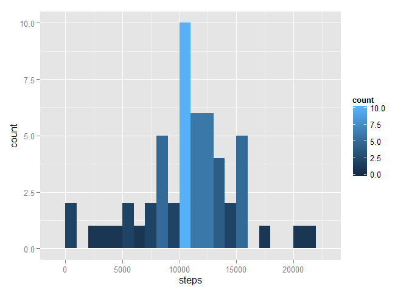
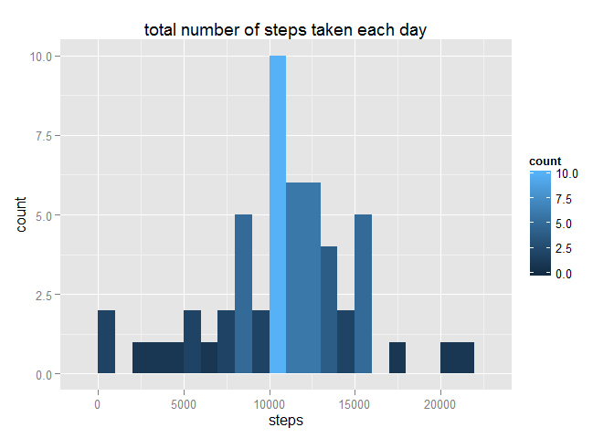
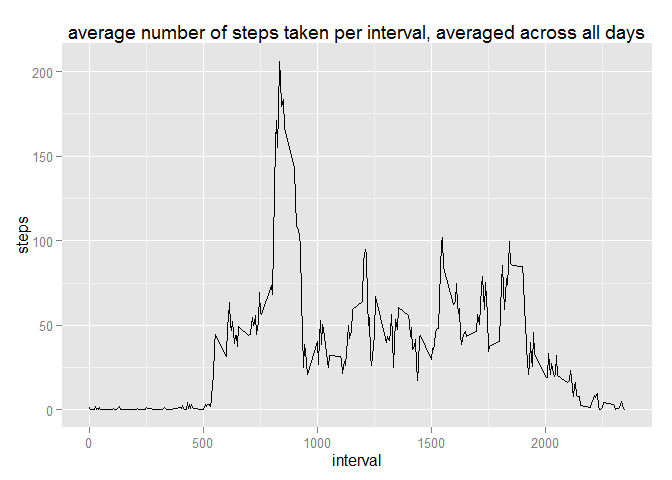
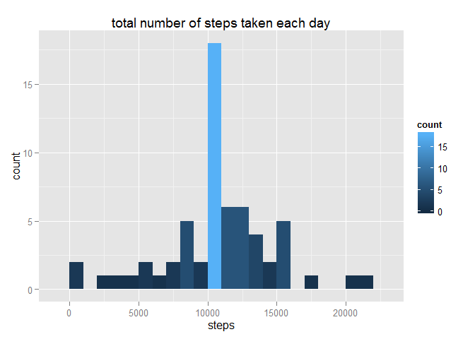

# Reproducible Research: Peer Assessment 1


## Loading and preprocessing the data

```r
Sys.setlocale("LC_TIME", "C")
```

```
## [1] "C"
```

```r
MyData <- read.csv(unz("activity.zip", "activity.csv"), sep = ",", header = TRUE, strip.white = TRUE)
MyData$date<-as.Date(MyData$date)
MyData$weekday<-weekdays(MyData$date, abbreviate = FALSE)
```


## What is mean total number of steps taken per day?


```r
library(stats)
library(ggplot2)
```

```
## Warning: package 'ggplot2' was built under R version 3.2.2
```

```r
StepsByDay<-aggregate(steps~date, data=MyData, sum)
m <- ggplot(StepsByDay, aes(x=steps)) 
m + geom_histogram(aes(fill = ..count..), binwidth=1000)
```

 

```r
print (paste ("Mean of steps per day: ", round(mean(StepsByDay$steps),2)))
```

```
## [1] "Mean of steps per day:  10766.19"
```

```r
print (paste ("Median of steps per day: ", round(median(StepsByDay$steps),2)))
```

```
## [1] "Median of steps per day:  10765"
```


## What is the average daily activity pattern?


```r
AvgStepsByInterval<-aggregate(steps~interval, data=MyData, mean)
qplot(interval, steps, data=AvgStepsByInterval, geom="line")
```

 

```r
print (paste("Max Interval: ", AvgStepsByInterval[AvgStepsByInterval$steps == max(AvgStepsByInterval$steps),]$interval))
```

```
## [1] "Max Interval:  835"
```


## Imputing missing values


```r
print(paste("Number of rows with NA: ", sum(rowSums(is.na(MyData)))))
```

```
## [1] "Number of rows with NA:  2304"
```

```r
library(dplyr)
```

```
## Warning: package 'dplyr' was built under R version 3.2.2
```

```
## 
## Attaching package: 'dplyr'
## 
## The following objects are masked from 'package:stats':
## 
##     filter, lag
## 
## The following objects are masked from 'package:base':
## 
##     intersect, setdiff, setequal, union
```

```r
FilledData<-MyData
FilledData[is.na(MyData$steps),"steps"] <- rep(AvgStepsByInterval$steps, 8)

FilledStepsByDay<-aggregate(steps~date, data=FilledData, sum)
m <- ggplot(FilledStepsByDay, aes(x=steps)) 
m + geom_histogram(aes(fill = ..count..), binwidth=1000)
```

 

## Are there differences in activity patterns between weekdays and weekends?


```r
FilledData<-mutate(FilledData, Week = factor(1 * (weekday %in% (c("Saturday", "Sunday"))), labels = c("Weekday", "weekend")))
FilledAvgStepsByInterval<-aggregate(steps~ interval + Week , data=FilledData, mean)

ggplot(FilledAvgStepsByInterval, aes(x=interval, y=steps, group=Week)) + geom_line() + facet_grid(Week~.)
```

 
